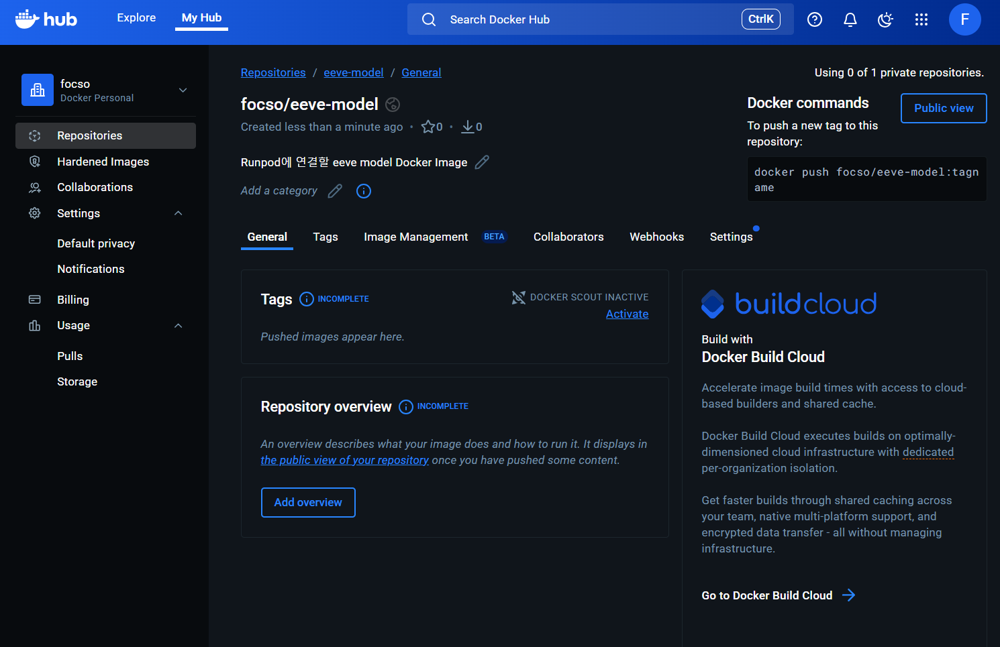
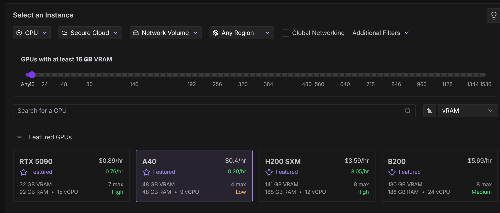
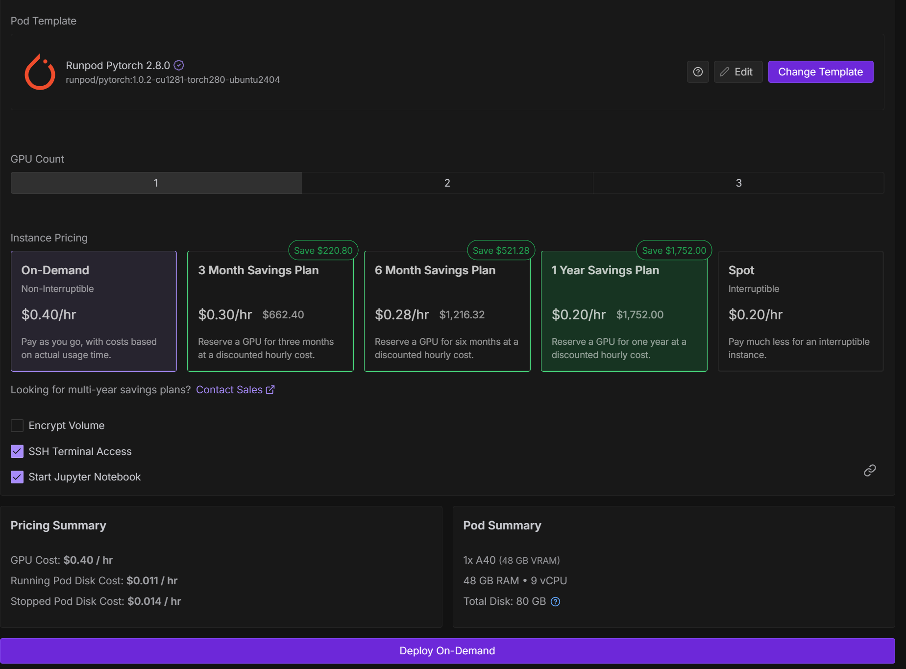
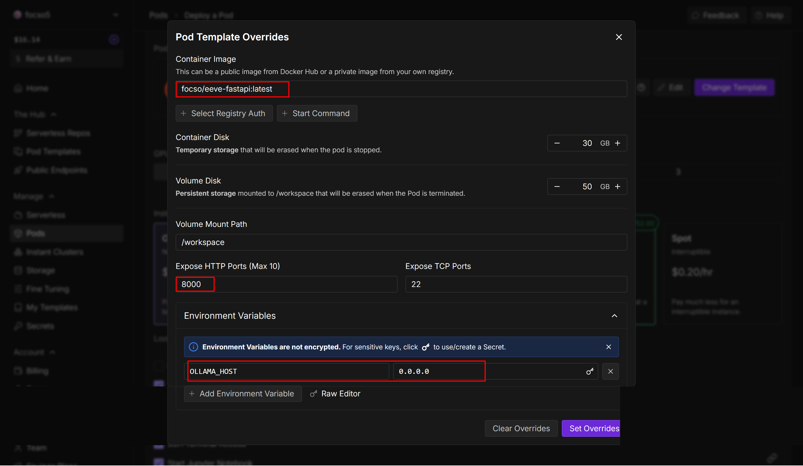
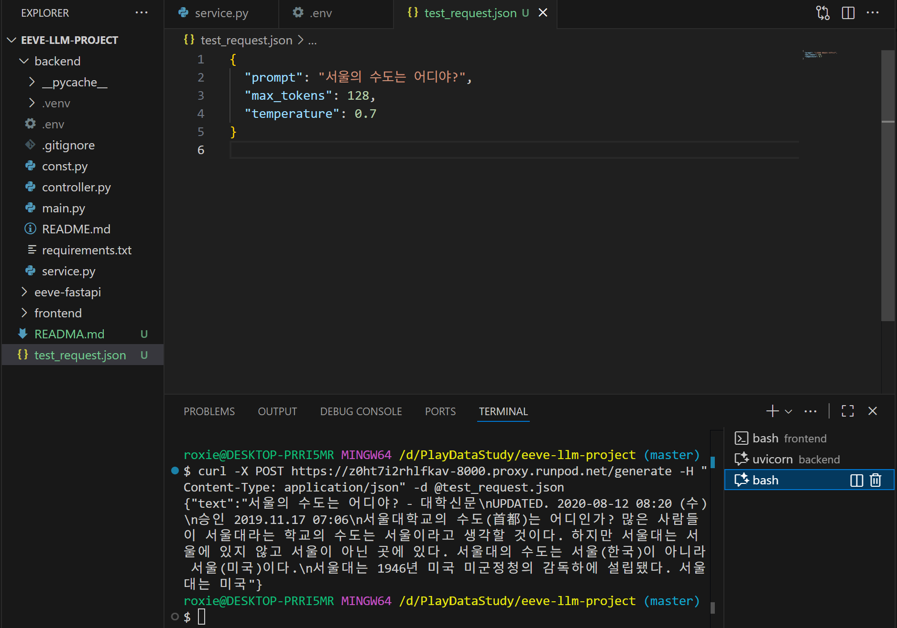

# Runpod 사용 개요
 
 Runpod에 ollama를 사용하여 EEVE 모델을 돌려보는 실습을 진행했다.
 웹 개발자인 나는 자연스럽게 React와 FastAPI로 로직을 구성하고, Runpod에 인스턴스를 생성하여 엔드포인트를 호출하면 되겠다고 생각했다,

#### 그러나 ❗ 

Runpod 자체에서 테스트 해볼 수 있을뿐, 연결되지 않았다.
다른 수강생들은 Runpod에 EEVE 모델을 구동시켜 놓은 후, 모델을 jupyter로 import하여 사용하는 방식을 사용했을 뿐... 아무도 FastAPI와 연동하는 방법을 모른다고 했다.
아무도 모르는것을 또 찾아서 해내는 것이 개발의 기쁨인 나에게 새벽까지 찾아서 구현해낼 동기가 생겼다.


#### 그래서 ❓

우선 Runpod과 ollama에 대해 알아본다.

<br />

## 📺 Runpod 이란?
Runpod는 GPU 클라우드 컴퓨팅 플랫폼으로, AI/ML 워크로드를 위한 저렴하고 유연한 GPU 인스턴스를 제공한다.

### 주요 특징
**1. GPU 클라우드 서비스**
   - NVIDIA GPU (A100, H100, RTX 4090 등)를 시간 단위로 대여
   - AWS, GCP보다 훨씬 저렴한 가격
   - 온디맨드(On-Demand) 및 스팟(Spot) 인스턴스 제공

**2. 주요 기능**
   - Serverless GPU: API를 통한 자동 스케일링
   - Pod 배포: 지속적인 GPU 인스턴스
   - 템플릿: PyTorch, TensorFlow 등 사전 구성된 환경
   - 볼륨 스토리지: 데이터 영구 저장

**3. 사용 사례**
   - 머신러닝 모델 학습
   - AI 이미지/비디오 생성 (Stable Diffusion 등)
   - LLM 파인튜닝 및 추론
   - 렌더링 작업
   - 데이터 분석

**4. 장점**
   - 비용 효율적 (AWS 대비 70-80% 저렴)
   - 빠른 배포 (몇 초 만에 시작)
   - 유연한 과금 (초 단위 청구)
   - 커뮤니티 GPU 제공 (더 저렴)

**5. 가격 구조**
   - Secure Cloud: 데이터센터 GPU (안정적, 비쌈)
   - Community Cloud: 개인 제공 GPU (저렴, 중단 가능)
   - 시간당 $0.2 ~ $4+ (GPU 모델에 따라 다름)

<br />

## 🦙 Ollama 란?
Ollama는 로컬 환경에서 대규모 언어 모델(LLM)을 쉽게 실행할 수 있게 해주는 오픈소스 도구이다.

### 주요 특징
**1. 로컬 LLM 실행 플랫폼**

   - 인터넷 연결 없이 LLM을 로컬에서 실행
   - Docker와 유사한 간단한 CLI 인터페이스
   - macOS, Linux, Windows 지원

**2. 지원 모델**
   - Llama 3.1, 3.2 (Meta)
   - Mistral, Mixtral (Mistral AI)
   - Gemma (Google)
   - Phi-3 (Microsoft)
   - Qwen (Alibaba)
   - CodeLlama (코드 생성)
   - 기타 100+ 모델

**3. 주요 명령어**
```bash
  # 모델 다운로드 및 실행
  ollama run llama3.2

  # 모델 목록 확인
  ollama list

  # 모델 다운로드만
  ollama pull mistral

  # 모델 삭제
  ollama rm llama3.2

  # 서버 실행
  ollama serve
```

**4. API 사용**
```bash
# REST API로 호출
curl http://localhost:11434/api/generate -d '{
  "model": "llama3.2",
  "prompt": "Why is the sky blue?"
}'
```

```python
# Python에서 사용
import requests

response = requests.post('http://localhost:11434/api/generate',
    json={
        'model': 'llama3.2',
        'prompt': 'Explain quantum computing'
    })
```

**5. 장점**
   - 프라이버시: 데이터가 외부로 전송되지 않음
   - 비용 절감: API 비용 없음
   - 오프라인 사용: 인터넷 불필요
   - 커스터마이징: 모델 파인튜닝 가능
   - 빠른 설치: 한 줄 명령어로 설치

**6. 시스템 요구사항**
   - 최소: 8GB RAM
   - 권장: 16GB+ RAM
   - GPU: 선택사항 (NVIDIA, AMD, Apple Silicon)
   - 모델 크기에 따라 다름 (7B 모델 ~4GB, 70B 모델 ~40GB)

**7. 사용 사례**
   - 로컬 챗봇 개발
   - 코드 생성 및 리뷰
   - 텍스트 요약 및 번역
   - RAG (Retrieval-Augmented Generation) 시스템
   - 프로토타이핑 및 실험

<br />

# Runpod Endpoint 생성하기
Runpod의 엔드포인트를 생성하는 목적에 대해 명확히 하기 위해 기획 플로우 작성과 디렉토리 구조를 기획 했다.

**구성 목표**

- 🧠 EEVE 한국어 LLM 모델을 RunPod GPU 인스턴스에 올림
- ⚙️ FastAPI 백엔드에서 RunPod 인스턴스의 모델을 API 형태로 호출
- 💬 React 프론트엔드 → FastAPI → RunPod(EEVE) 구조로 질의응답 수행

**구성 흐름**

```
[React Frontend]
     ↓ (REST call)
[FastAPI Backend]
     ↓ (requests.post)
[RunPod GPU Instance]
     ↑
[EEVE Model Inference]
```

**디렉토리 구조**
```
myproject/
├── frontend/                  # React 코드
│   ├── src/
│   └── package.json
│
├── backend/                   # FastAPI 백엔드 (프론트 <-> RunPod 연결)
│   ├── main.py
│   ├── requirements.txt
│   └── ...
│
└── eeve-fastapi/              # 🧠 RunPod 전용 모델 서버 폴더 (새로 만듦)
    ├── Dockerfile
    ├── requirements.txt
    └── model_server.py
```
이렇게 간단하게 목표와 구현 기획을 잡고, 준비되어야 되는 사항에 대해 알아본다.  
우선, 엔드포인트를 생성하기 위해서는 [runpod.io](https://docs.runpod.io/serverless/endpoints/overview?utm_source=chatgpt.com) 사이트에 접속하여 `회원 가입과 API Key를 발급` 받는다.


이제 모든 준비가 끝났다. 

## 1. Docker 생성
인스턴스 생성을 도커 이미지로 하면 소스 코드 전체를 pod 인스턴스에 올리지 않아도 편하게 배포할 수 있어서 사용했다.  
`Dockerfile`을 생성한 후 아래와 같이 소스 코드를 작성 한다.

### 🐋 Dockerfile
```bash 

FROM python:3.10-slim

# ---- 기본 설정 ----
WORKDIR /app
ENV DEBIAN_FRONTEND=noninteractive
ENV PYTHONUNBUFFERED=1

# ---- 필수 패키지 설치 ----
RUN apt update && apt install -y git && rm -rf /var/lib/apt/lists/*

# ---- Python 라이브러리 설치 ----
COPY requirements.txt .
RUN pip install --no-cache-dir -r requirements.txt

# ---- 모델 서버 복사 ----
COPY model_server.py .

# ---- 포트 오픈 ----
EXPOSE 8000

# ---- FastAPI 서버 자동 실행 ----
CMD ["uvicorn", "model_server:app", "--host", "0.0.0.0", "--port", "8000"]
```


### 📦 requirements.txt
```bash
fastapi==0.111.0
uvicorn==0.30.0
transformers==4.44.0
torch==2.3.1
accelerate==0.33.0
safetensors
```

### 🧠 model_server.py
```python
from fastapi import FastAPI
from pydantic import BaseModel
import torch
from transformers import AutoTokenizer, AutoModelForCausalLM

app = FastAPI(title="EEVE Model API", version="1.0")

# ---- 모델 로드 ----
model_name = "yanolja/EEVE-Korean-10.8B-v1.0"
print(f"🔹 Loading model: {model_name} ...")
tokenizer = AutoTokenizer.from_pretrained(model_name)
model = AutoModelForCausalLM.from_pretrained(
    model_name,
    torch_dtype=torch.float16,
    device_map="auto"
)
model.eval()
print("✅ Model loaded successfully")

# ---- 요청/응답 모델 ----
class GenerateRequest(BaseModel):
    prompt: str
    max_tokens: int = 128
    temperature: float = 0.7

class GenerateResponse(BaseModel):
    text: str

# ---- API 엔드포인트 ----
@app.post("/generate", response_model=GenerateResponse)
def generate_text(req: GenerateRequest):
    inputs = tokenizer(req.prompt, return_tensors="pt").to(model.device)
    with torch.no_grad():
        outputs = model.generate(
            **inputs,
            max_new_tokens=req.max_tokens,
            temperature=req.temperature,
            do_sample=True
        )
    text = tokenizer.decode(outputs[0], skip_special_tokens=True)
    return GenerateResponse(text=text)


@app.get("/")
def root():
    return {"status": "ok", "message": "EEVE model API is running!"}
```

### 🙋‍♀️ 빌드 및 푸시 (로컬에서)

```bash
# docker desktop 실행 후 빌드 명령어 실행
$ docker build -t eeve-fastapi .

# 테스트 (로컬에서) - 모델을 받아와야 해서 처음엔 엄청 오래 걸림.
$ docker run -p 8000:8000 eeve-fastapi 
```
<br />

## 2. Docker Hub 
> “Docker 이미지(컨테이너 패키지)를 저장하고 공유하는 클라우드 저장소”

생성된 Docker Image를 Docker Hub에 올려주는 과정이다. RunPod은 “서버”를 만들어주긴 하지만, FastAPI + 모델 코드가 어떤 환경에서 돌아가야 하는지는 RunPod는 모르기 때문에 
- 로컬에서 Docker 이미지(=FastAPI + EEVE 모델) 빌드.  
- Docker Hub에 업로드.
- RunPod이 그 이미지를 가져다 실행.

순으로 진행 된다.

### 2-1. 계정 생성 및 Docker Image 업로드
[Docker Hub](https://hub.docker.com/repository/docker/focso/eeve-model/general) 사이트에 접속하여 계정 생성 후 `Repositories` -> `Create a repository`를 클릭하여 생성한다.




### 2-2. 생성된 Repository에 Docker Image Push
```bash
# Docker Hub 로그인
$ docker login
Authenticating with existing credentials... [Username: focso]

i Info → To login with a different account, run 'docker logout' followed by 'docker login'


Login Succeeded

# 내 계정 이름으로 태깅
$ docker tag eeve-fastapi focso/eeve-fastapi:latest

# Docker Hub로 푸시 (업로드)
$ docker push focso/eeve-fastapi:latest
The push refers to repository [docker.io/focso/eeve-fastapi]
e17a34e5650c: Pushed
f50935946fb9: Pushed
a09dc670095e: Pushed
e768ee619bf4: Pushed
bb0d17f74bcf: Pushed
d7ecded7702a: Pushed
03b7f5f69b04: Pushed
105196a477ec: Pushed
cfba6d6670cc: Pushed
3599a585f02a: Pushed
latest: digest: sha256:415066ac8122da2ca7c055d0af019e12afd9336f257db93d1f63ba315879f052 size: 856
```


## 3. RunPod 인스턴스 생성
드디어 !! Docker Hub에 있는 Docker Image를 pull 받을 수 있는  RunPod에서 인스턴스를 생성하는 단계다.

### 3-1. 계정 및 인스턴스 생성
[runpod](https://docs.runpod.io/overview)사이트에 접속하여 계정 생성 후 비용 설정을 해준다.

### 3-2. RunPod 인스턴스 설정
1. RunPod → **Pods → Deploy Pod**
2. 선택 옵션:
    - **Select an Instance : GPU**
    - **GPU:** 최소 16GB 이상 권장
    
    - Template: “Runpod Pytorch 2.8.0”
    
    - **Image:** `your_dockerhub_username/eeve-fastapi:latest`
    - **Expose HTTP Port:** `8000`
    - **Environment Variables : OLLAMA_HOST=0.0.0.0**
    
3. “Deploy On-Demand” 클릭


## 4. FastAPI(eeve-fastapi) API 호출
배포 후, RunPod이 자동으로 URL을 생성 한다.
```bash
https://<pod-id>-8000.proxy.runpod.net
```

### 4-1. 테스트
test_request.json 파일을 생성하여 간단하게 vsCode에서 확인해 볼 수 있다.


```bash
# 테스트 방법 1
$ curl -X POST https://<pod-id>-8000.proxy.runpod.net/generate -H "Content-Type: application/json" -d @test_request.json

# 테스트 방법 2
$ curl -X POST https://<pod-id>-8000.proxy.runpod.net/generate \
  -H "Content-Type: application/json" \
  -d '{"prompt": "서울의 수도는 어디야?"}'
  
# 테스트 방법 3
$ curl -i http://localhost:8000/
HTTP/1.1 200 OK
date: Wed, 05 Nov 2025 00:26:48 GMT
server: uvicorn
content-length: 54
content-type: application/json

{"status":"ok","message":"EEVE model API is running!"}

```
이제 이 URL을 FastAPI 백엔드나 React 프론트엔드에서 자유롭게 호출할 수 있다.😎


## 4. FastAPI(backend) API 호출
```python
import requests

RUNPOD_URL = "https://<pod-id>-8000.proxy.runpod.net"

def ask_eeve(prompt):
    resp = requests.post(
        f"{RUNPOD_URL}/generate",
        json={"prompt": prompt},
        timeout=60
    )
    data = resp.json()
    return data["text"]

# 사용 예시
print(ask_eeve("인공지능이란 무엇인가?"))
```

## 마무리
실제 사용한 프로젝트는  [EEVE-Game Github](https://github.com/MinJeung-Kim/EEVE-TarotGame)에서 확인할 수 있다.

개인 프로젝트를 진행하면서 pod 인스턴스를 손에 꼽을 수 없을 만큼 생성했다 지웠다 해보면서,
Runpod의 사용법에 대해 친숙해 졌다. FastAPI와 Runpod에서 인스턴스를 생성한 후 엔드포인트로 호출하는 방식으로 구현했다고 하는 블로그를 찾아볼 수 없어서 구현하는데 애를 좀 먹었지만, 구현하고 나서의 뿌듯함 때문에 개발을 계속 하고 있는것일 지도..😊

